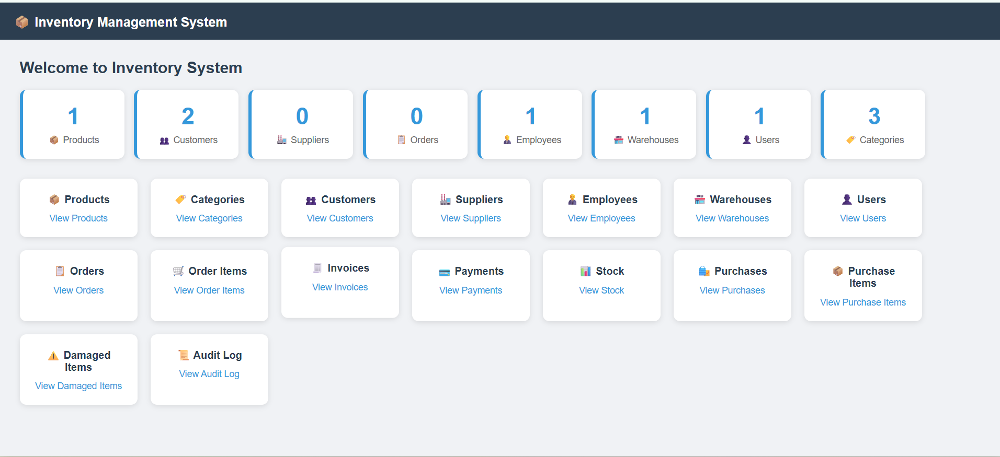

# 📦 Inventory Management System

A full-stack Inventory Management System built with **Spring Boot**, **MySQL**, and **Thymeleaf**.

## 🚀 Tech Stack
- **Backend:** Spring Boot (Java)
- **Database:** MySQL
- **Frontend:** Thymeleaf + HTML + CSS
- **Version Control:** Git & GitHub

## ✅ Features
- 16 Tables with Full CRUD operations
- Dashboard with live statistics
- Products, Categories, Customers, Suppliers
- Orders, Order Items, Invoices, Payments
- Employees, Warehouses, Users
- Stock, Purchases, Purchase Items
- Damaged Items, Audit Log

## 📸 Dashboard

## 🗄️ Database Tables
| # | Table | Description |
|---|-------|-------------|
| 1 | Products | Product management |
| 2 | Categories | Product categories |
| 3 | Customers | Customer records |
| 4 | Suppliers | Supplier management |
| 5 | Employees | Employee records |
| 6 | Warehouses | Warehouse locations |
| 7 | Users | System users |
| 8 | Orders | Customer orders |
| 9 | Order Items | Order line items |
| 10 | Invoices | Invoice management |
| 11 | Payments | Payment records |
| 12 | Stock | Stock tracking |
| 13 | Purchases | Purchase orders |
| 14 | Purchase Items | Purchase line items |
| 15 | Damaged Items | Damaged goods tracking |
| 16 | Audit Log | System activity log |

## ⚙️ How to Run
1. Clone the repository
2. Setup MySQL database `inventory_system`
3. Update `application.properties` with your credentials
4. Run: `./mvnw spring-boot:run`
5. Open: `http://localhost:8080`

## 👨‍💻 Developer
**Roshan** — CS Student